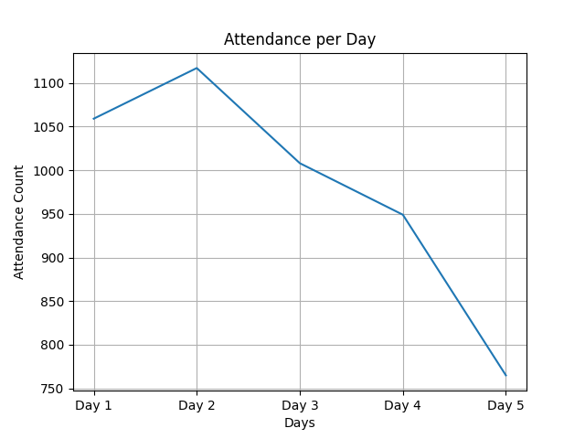
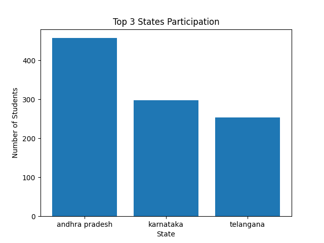
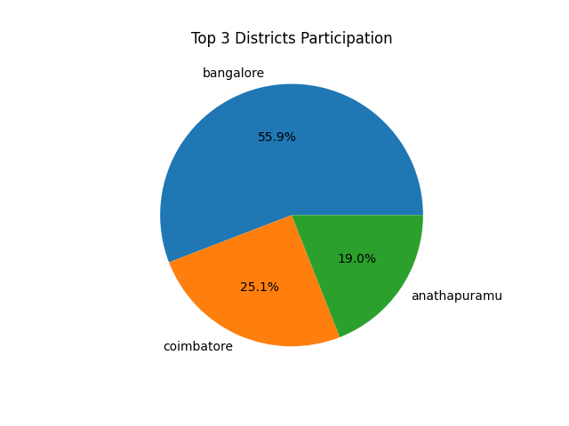

# Data Analysis of 5 Day Live Class

This folder contains all datasets, reports, and visualizations from the 5-day live class analysis.

## 📂 Files in this folder

### 📊 CSV Reports
 [Attedence.csv](Attedence.csv)
- [Branches_report.csv](Branches_report.csv)
- [Cleaned_data.csv](Cleaned_data.csv)
- [Collagewise_participation](Collagewise_participation)
- [Distric_Wise_report.csv](Distric_Wise_report.csv)
- [StateWise_report.csv](StateWise_report.csv)
- [attendance_report.csv](attendance_report.csv)
- [cleaned_master.csv](cleaned_master.csv)
### 📓 Jupyter Notebook
- [Innomatic_data_labs_task.ipynb](Innomatic_data_labs_task.ipynb)

### 📷 Visualizations

